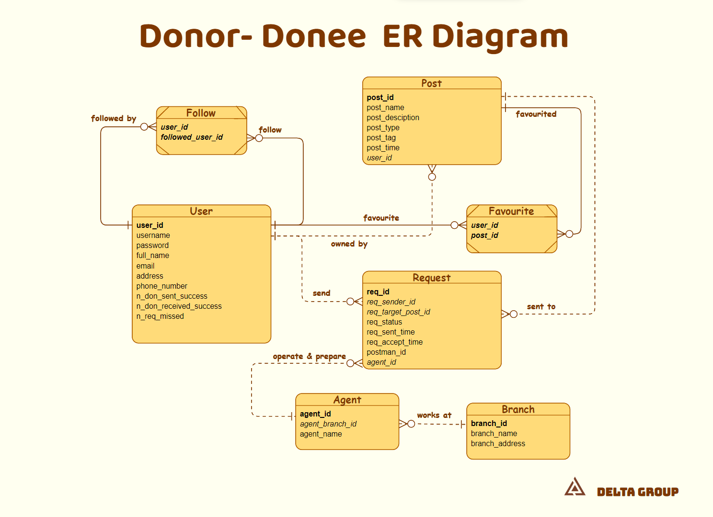

# Design Overview
Donor/Donee Application design Project for EGCO321 Database & EGCO343 Software Design

# Links
- [SRS Software Requirement Specification](https://docs.google.com/spreadsheets/d/1LbI3-tEK-H4SgEiou8ps1dVFIKa1ZUSD/edit#gid=1888782410)
- [Data Dictionary](https://docs.google.com/spreadsheets/d/171JdCZPft2UUQCD8g1HEjEpYSKNNE8YKu2Qt74dbiJM/edit#gid=1902153831)
- [ER Diagram](https://online.visual-paradigm.com/share.jsp?id=323231313436312d31#diagram:workspace=cwkwxdsz&proj=0&id=1)
- [Class Diagram](https://online.visual-paradigm.com/share.jsp?id=323231313436312d32#diagram:workspace=cwkwxdsz&proj=0&id=2)

# Diagrams



### Class diagram : Java implementation example
```Java
public class Main {
	public static void main(String[] args) {
		Post myPost = new Post();
		myPost.addTag(Tag.clothes);
		myPost.addTag(Tag.furniture);

		if (myPost.hasTag(Tag.clothes)) {
			// do something
			System.out.println(Tag.clothes.getName());
		}
	}
}
```
```Java
class Post {
	private ArrayList<Tag> taglist = new ArrayList<>();

	public Post() {}

	public void addTag(Tag t) {
		taglist.add(t);
	}
	public boolean hasTag(Tag t) {
		if (taglist.contains(t)) return true;
		return false;
	}
}
```
```Java
class Tag {
	private String typename;

	public Tag(String tn) {
		typename = tn;
	}

	public String getName() { return typename; }

	public static Tag clothes = new Tag("Clothes and Wearables");
	public static Tag food = new Tag("Food and Drinks");
	public static Tag furniture = new Tag("Furniture");
}
```

# Agent Functions
แสดงการกระทำต่างๆ ที่ Agent แต่ละคนสามารถทำได้

## Application Automation
 - Notification `(เมื่อมีการส่งคำขอ)`

## User
  - Login
  - Register
  - Create post
  - View posts
  - Edit post
  - Delete post
  - Send request
  - View all requests
  - Accept/Deny request
  - Report anomalies
  - View profile
  - Edit profile
  - แสดง Donation code `(อาจเป็น QR code หรือ Barcode เพื่อให้ เจ้าหน้าที่รับของ สามารถรู้รายละเอียดของที่บริจาค)`
  
#### `User type (1 user เป็นได้ทั้งสอง type)`
	- ผู้ให้บริจาค
	- ผู้รับบริจาค

## เจ้าหน้าที่รับของจากผู้ให้บริจาค
  - แสกน Donation code จาก User ปริ้นใบจ่าหน้าพัสดุ และดำเนินการเตรียมส่ง
    หลังจากแสกน ระบบจะส่งสถานะกลับมายังแอปว่า ผู้ให้บริจาค ส่งของมาแล้ว
  - กดว่าส่งของคืน ผู้ให้บริจาค ในกรณี ส่งไม่สำเร็จ

## คนส่งของ
  - กดว่าของถึงปลายทางแล้ว
  - อัปเดต`(โดยกรอกสาเหตุการจัดส่งขัดข้อง)`ในระบบว่าของส่งไม่สำเร็จ
  และดำเนินส่งของกลับไปยังสำนักงาน เพื่อให้เจ้าหน้าที่รับของดำเนินส่งของคืน ผู้ให้บริจาค


# ประเภทสิ่งของ
	- เครื่องแต่งกาย, อาหารและเครื่องดื่ม, ยาและเวชภัณฑ์ 
	- อุปกรณ์อิเล็กทรอนิคและเครื่องใช้ไฟฟ้า, เฟอร์นิเจอร์, 
	- หนังสือ, เครื่องเขียน, ของใช้ในห้องน้ำ, 
	- ของใช้ในห้องครัว, เครื่องนอน, อุปกรณ์จัดสวน, อุปกรณ์สัตว์เลี้ยง
	- อุปกรณ์กีฬา, ของใช้ส่วนตัว, เบ็ดเตล็ดและอื่นๆ

# Function details

## Login 
  - Username
  - password
## Register
  - Username
  - password
  - confirm password
  - email
  - full name
  - address`(default)` `{details, province, district, postal code}`
  - telephone number
  - [checkbox] term of service
## รายละเอียด post ผู้ให้บริจาค
  - ชื่อโพสต์, รายละเอียด, ใส่ภาพถ่าย, เลือกประเภท, ช่องทางการติดต่อ
  - เลือกที่อยู่: `{จากตอนสมัคร, กรอกใหม่}`
  - การจ่ายค่าจัดส่ง`(บริษัทขนส่ง)` -> ติดต่อกันเอง

## รายละเอียด post ผู้รับบริจาค
  - ชื่อโพสต์, รายละเอียด, เลือกประเภท, ช่องทางการติดต่อ
  - เลือกที่อยู่

## View Post
<!---------->
### หน้าดูโพสต์รวม View all post 
  - textfield search keyword from post name
  - Filter
	> -	ประเภทโพสต์: `{ผู้รับบริจาค, ผู้ให้บริจาค}`
	> -	ประเภทสิ่งของ: `{...}`
	> -	ภูมิภาค
	> -	โพสต์ที่ปักหมุด
  
  - Sort `{ จำนวนคนให้บริจาค, เวลาโพสต์ }`
  - มีหลายหน้า มีปุ่มเปลี่ยนหน้า
  - แสดงโพสต์แต่ละโพสต์ที่ค้นพบ โดยแสดงชื่อ 
    ประเภท`(tag)` ภาพ`(เมื่อเป็นการให้บริจาคสิ่งของ)` จังหวัด รายละเอียดคราวๆ

### หน้าดูรายละเอียดโพสต์

  * โพสต์ผู้ให้บริจาค
	- ชื่อโพสต์, รายละเอียด, ภาพถ่าย, ประเภท, ช่องทางการติดต่อ, จำนวนผู้รับ`(เมื่อรับครบแล้วโพสต์จะปิดอัตโนมัติ)`
	- ที่อยู่
	- ปุ่มส่งคำขอรับบริจาค
		> - ผู้อยากรับส่งคำขอรับ เพื่อให้ผู้ให้บริจาคตรวจสอบและเลือกผู้ที่จะให้ในกรณีมีหลายคนขอ
    	> - คำขอหมดอายุ ภายใน 30 วัน
		> - `เมื่อสำเร็จ`: ระบบแจ้งเตือนให้เจ้าของโพสต์ทราบ
    	> - `เมื่อคำขอหมดอายุ`: ระบบแจ้งเตือนให้เจ้าของคำขอทราบว่า หมดอายุแล้ว และลบคำขอออกจากระบบ
	
  * โพสต์ผู้รับบริจาค
	- ชื่อโพสต์, รายละเอียด, ประเภท, ช่องทางการติดต่อ
  	- ที่อยู่
	- ปุ่มส่งคำขอให้บริจาค 
		> - ผู้อยากให้ต้องกรอก รายละเอียดเสริม, ใส่ภาพถ่าย, ช่องทางการติดต่อ, ที่อยู่
    	> - คำขอหมดอายุ ภายใน 30 วัน
		> - `เมื่อสำเร็จ`: ระบบแจ้งเตือนให้เจ้าของโพสต์ทราบ
    	> - `เมื่อคำขอหมดอายุ`: ระบบแจ้งเตือนให้เจ้าของคำขอทราบว่า หมดอายุแล้ว และลบคำขอออกจากระบบ


## View all requests
<!---------->
### View 'received' request to our post <span style="color: #7d7d7d">*(ดูคำขอที่คนอื่นที่ส่งมา)*</span>
   - แสดง request ของคนอื่นที่ส่งมายังโพสต์ของตนเอง
   - เลือกประเภทโพสต์ `{โพสต์รับบริจาค, โพสต์ให้บริจาค}`
   * หน้าเลือกว่าจะให้ของบริจาคใครบ้าง
	  - ระบบส่งแจ้งเตือนไปให้ ผู้ที่ส่งคำขอรับบริจาคว่า คำขอสมบูรณ์
      - ระบบส่ง popup ว่า <span style="color: #fda964">"ให้ดำเนินการจัดส่งภายใน 7 วัน"</span>
      - เจ้าของโพสต์`(ผู้ให้บริจาค)` ดำเนินการส่งมอบของไปที่สำนักงาน/โทรแจ้งเจ้าหน้าที่ให้มารับของหากไม่สะดวกมาส่งของที่สำนักงานเอง โดยแสดง Donation code ให้กับเจ้าหน้าที่
        > - โดยหากไม่ดำเนินการจัดส่งภายใน 7 วัน request จะถูกยกเลิก, หักค่า credit ของผู้ให้บริจาค
        > - และระบบจะลบโพสต์ และแจ้งเตือนให้กับทั้งสองฝ่าย
   * หน้าเลือกว่ารับของจากใครบ้าง
      - ระบบส่งแจ้งเตือนไปให้ ผู้ที่ส่งคำขอให้บริจาคว่า คำขอสมบูรณ์
      - ผู้ให้บริจาค ดำเนินการส่งมอบของไปที่สำนักงาน/โทรแจ้งเจ้าหน้าที่ให้มารับของหากไม่สะดวกมาส่งของที่สำนักงานเอง โดยแสดง Donation code ให้กับเจ้าหน้าที่
        > - โดยหากไม่ดำเนินการจัดส่งภายใน 7 วัน request จะถูกยกเลิก, หักค่า credit ของผู้ให้บริจาค และแจ้งเตือนให้กับทั้งสองฝ่าย
### View request 'send' to other post <span style="color: #7d7d7d">*(ดูคำขอที่ส่งไปยังโพสต์ของผู้อื่น)*</span>
   - แสดง request ของเราที่ส่งไปยังโพสต์ของผู้อื่น
   - เลือกประเภทโพสต์ที่ส่งคำขอไป `{โพสต์รับบริจาค, โพสต์ให้บริจาค}` เพื่อดูรายละเอียดคำขอที่ส่งไป
   - แสดงสถานะของคำขอที่ส่งไป
     * ส่งคำขอไปที่ โพสต์รับบริจาค หรือ โพสต์ให้บริจาค
        > - หากเจ้าขอโพสต์เลือก request ของเรา ระบบจะส่งแจ้งเตือนกลับมาว่าคำขอของเราถูกเลือกแล้ว
     * ส่งคำขอไปที่ โพสต์รับบริจาค
        > - หาก คำขอให้บริจาค ของเราถูกเลือก ต้องกดยืนยันว่าพร้อมส่งแล้ว ระบบส่ง popup ว่า <span style="color: #fda964">"ให้ดำเนินการจัดส่งภายใน 7 วัน"</span>
        > - โดยต้องกดยืนยันภายใน 7 วันหลังจากที่ถูกเลือก จากนั้นจึงดำเนินการส่ง
        > - หลังจาก คำขอให้บริจาค ของเราถูกเลือก ให้ระบบแสดงระยะเวลาที่เหลือสำหรับการยืนยันว่าพร้อมส่ง
        > - โดยหากไม่ดำเนินการจัดส่งภายใน 7 วัน request จะถูกยกเลิก, หักค่า credit ของผู้ให้บริจาค
        > - และระบบจะลบโพสต์ และแจ้งเตือนให้กับทั้งสองฝ่าย
   - ยกเลิก request ของเรา
<!---------->

## View profile
   - ชื่อ รายละเอียดส่วนตัว รูปโปรไฟล์
   - จำนวนการให้บริจาคที่สำเร็จ
   - จำนวนการรับบริจาคที่สำเร็จ
   - จำนวนครั้งที่ไม่ดำเนินการส่งตามเวลาที่กำหนด `(จำนวนครั้งที่ไม่ส่งของ)`
   - แสดงประวัติรายการ `{ การให้บริจาคที่สำเร็จ, การรับบริจาคที่สำเร็จ }`

# จุดประสงค์ของแอป
  - `(หลัก)` เพื่อเป็นแหล่งแลกเปลี่ยนสิ่งของบริจาคต่างๆ
  - เพื่อให้สามารถแลกเปลี่ยนสิ่งของบริจาคได้อย่างมันใจ`(ว่าส่งของถึงปลายทาง ส่งของแล้วได้ใช้ประโยชน์จริง)`

